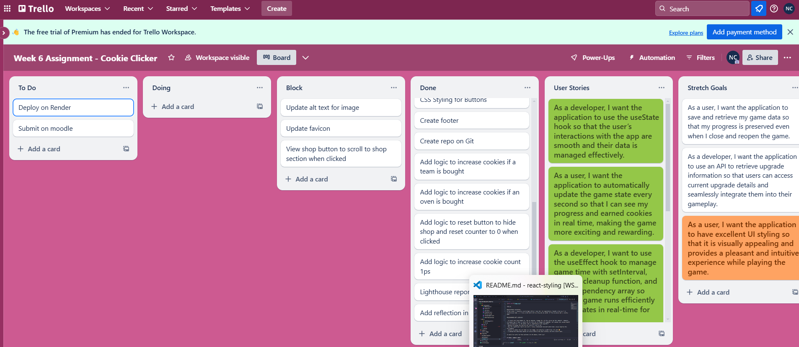

REFLECTION

GitHub: https://github.com/Natasha-C-creator/week6assignment
Render: https://week6assignment-1.onrender.com/

WIREFRAME:

TRELLO:

REQUIREMENTS ACHIEVED:
In one sense, I actually surprisingly think I have met the requirements (based on the way I've interpreted them...). I also tried hard with styling too so wonder if that actually met a stretch goal.

REQUIREMENTS NOT ACHIEVED:

- It meets the requirement of 'buy an upgrade, change the cookies amount by that amount'. However, I'm wondering if what it should be is: once you've bought the upgrade, the cookies per second should then increase by 5 or 10 rather than 1, depending on the upgrade??
- Wanted to change the favicon but couldn't work it out
- Ran the lighthouse report but didn't really understand the part about how I could improve the performance
- Wanted to update the alt text for the image, but actually couldn't work it out! 😳
- I wanted the View Shop button to scroll down to the shop section, but this didn't work.

It would be useful to have pointers on the above; thank you!

EXTERNAL SOURCES USED:
https://www.youtube.com/watch?v=0ZJgIjIuY7U
https://www.youtube.com/watch?v=O6P86uwfdR0
https://react.dev/reference/react/useRef
https://www.w3schools.com/react/react_useref.asp
ChatGPT
https://hackernoon.com/setting-scroll-position-in-react
TechEd Moodle workshops

WHAT WENT REALLY WELL:
React and I have made friends this week! I totally understand the basics of building your components and then bringing them together as and when you needed them.

This is the first week that I have created one project and 'coded along' during the workshops on that one single project. This was because creating the react package took so long, it made sense to just keep working on the first one. It actually helped me so much because I could see things come together and I felt like I'd given myself a head start.

Whilst I wasn't friends with CSS earlier in the course, as more difficult things have been introduced, I found myself enjoying the CSS! I googled quite a lot of effects and implemented those for a better user experience.

I liked using Trello again to structure the project. It enabled me to have a point of reference when I was wondering what to do next.

WHAT COULD HAVE GONE BETTER:
I understand the logic in terms of the English language and the order in which you're trying to achieve things, but I'm not familiar enough with the syntax to write this out myself so I'm relying heavily on the workshops or articles on the internet.

I also get so confused with () and {} and <>... The react errors are much more helpful in working out where I'm missing closing brackets etc, but I find I spend a lot of time just trying to spot rogue brackets!

Interestingly, ChatGPT was helpful to debug and spot missing brackets etc but I found that you could ask for help on the same thing twice and it would contradict itself with its second answer. This isn't a bad thing, as it forced me to look elsewhere for answers.

Overall, I'm just really pleased to have made something that resembles an app that mostly works!
